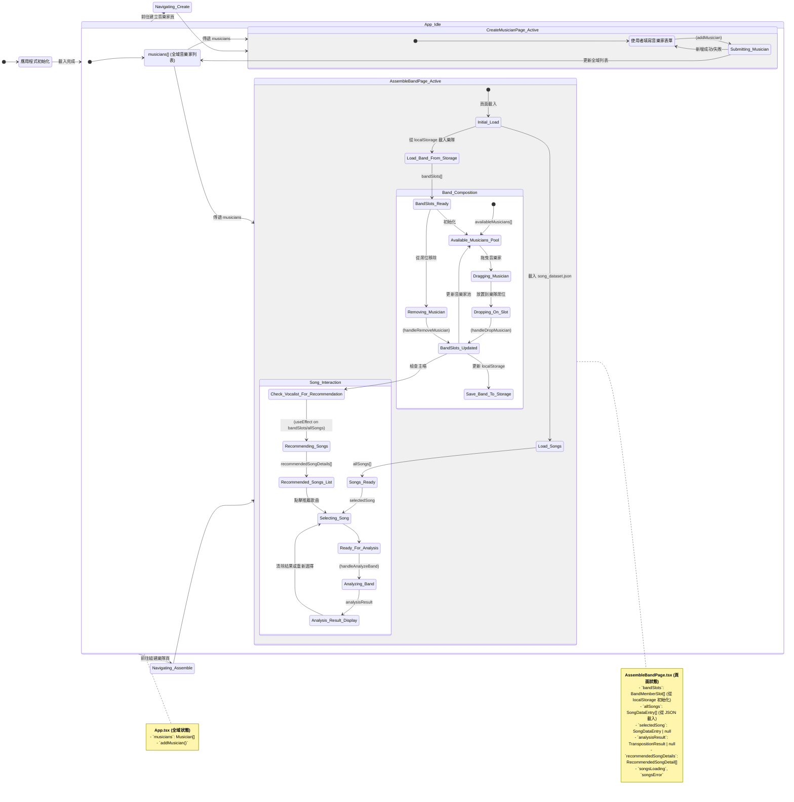

# 專案功能與狀態設計 (Data Design)

本文檔總結了「虛擬樂隊產生器」應用程式的主要功能和狀態管理流程。

## 主要功能列表

1.  **音樂家管理 (`CreateMusicianPage.tsx`)**
    *   **建立音樂家**：
        *   輸入音樂家姓名、簡介。
        *   新增多個樂器/專長，包含：
            *   樂器/角色 (如：主唱、吉他手、鼓手)。
            *   技能等級 (1-5)。
            *   主要風格。
            *   **針對聲樂家 (Vocalist)**：
                *   可選填描述性音域標籤 (如：男高音、女低音)，選擇後會自動填充建議的精確音域。
                *   可手動輸入精確最低音 (如 C3) 和精確最高音 (如 G5)。
        *   設定音樂家整體主要風格。
        *   選擇是否為核心成員。
    *   **顯示音樂家列表**：
        *   以卡片形式展示已建立的音樂家。
        *   顯示音樂家的核心資訊，包括姓名、樂器/專長、技能等級、主要風格。
        *   對於聲樂家，會顯示其精確音域。
    *   **(未來可能)** 編輯和刪除音樂家功能 (目前狀態從 App.tsx 傳遞，但操作介面未完全實作於此頁面)。

2.  **樂隊組建與分析 (`AssembleBandPage.tsx`)**
    *   **樂隊席位管理**：
        *   提供預設的樂隊樂器編制席位 (如：男主唱、電吉他、鼓、鍵盤、貝斯、女主唱)。
        *   每個席位有其允許的音樂家角色。
    *   **音樂家池**：
        *   顯示所有已建立且尚未被選入樂隊的音樂家。
        *   音樂家卡片顯示姓名、主要風格和部分專長資訊（聲樂家會顯示音域）。
    *   **拖曳與放置 (Drag and Drop)**：
        *   使用 `react-dnd` 實現。
        *   可將「音樂家池」中的音樂家拖曳到「樂隊席位」中。
        *   放置時會檢查音樂家的角色是否符合席位要求。
        *   拖曳和放置時有視覺回饋 (透明度、邊框、背景高亮、放大效果)。
    *   **移除樂隊成員**：
        *   可以從樂隊席位中移除已放置的音樂家。
    *   **樂隊狀態持久化**：
        *   樂隊的成員配置 (僅音樂家 ID) 會儲存到瀏覽器的 `localStorage`，下次載入頁面時會自動還原。
    *   **歌曲資料載入**：
        *   從 `public/song_dataset.json` 非同步載入歌曲資料。
        *   提供錯誤處理和載入狀態提示。
    *   **歌曲推薦 (基於主唱音域)**：
        *   當樂隊中配置了主唱且主唱設定了有效音域後，自動觸發。
        *   遍歷所有歌曲，使用 `findOptimalTransposition` 工具函式計算每首歌與主唱音域的匹配度。
        *   推薦「完美匹配」（無需移調且無警告）或「小幅移調後舒適」（移調 <= 3 半音且無警告）的歌曲。
        *   推薦列表會排序 (完美匹配優先 > 移調幅度 > 歌名)。
        *   推薦歌曲以列表形式展示，包含歌名、風格、原音域和移調建議。
        *   完美匹配的歌曲有特殊圖示 (`CheckCircleIcon`) 和背景。
        *   點擊推薦歌曲可以將其設為「詳細分析」的目標歌曲。
    *   **歌曲詳細音域分析**：
        *   使用者可以從下拉選單選擇一首歌曲進行分析。
        *   點擊「開始評估！」按鈕，觸發分析。
        *   分析基於當前樂隊中的主唱（第一個符合條件的聲樂家）及其音域，以及選定的歌曲音域。
        *   使用 `findOptimalTransposition` 計算最佳移調建議。
        *   結果顯示包括：
            *   綜合建議訊息 (如：無需移調、建議升/降 Key、可能挑戰極限音、無法完整演唱等)。
            *   歌手的 MIDI 音高範圍。
            *   歌曲原始 MIDI 音高範圍。
            *   移調後的歌曲 MIDI 音高範圍 (如果發生移調)。
    *   **UI/UX 優化**：
        *   按鈕、卡片、下拉選單等元件有 `hover`, `active` 等互動狀態的視覺變化。
        *   使用了 Heroicons 圖示。

3.  **全域狀態管理 (`App.tsx`)**
    *   管理音樂家列表 (`musicians`)。
    *   提供新增音樂家 (`addMusician`) 的函式，並將其傳遞給 `CreateMusicianPage`。
    *   (未來可能擴展 `updateMusician`, `deleteMusician` 並傳遞)。
    *   將音樂家列表傳遞給 `CreateMusicianPage` 和 `AssembleBandPage`。

4.  **路由 (`App.tsx`)**
    *   使用 `react-router-dom` 設定頁面路由：
        *   `/` (首頁) -> `CreateMusicianPage`
        *   `/create-musician` -> `CreateMusicianPage`
        *   `/assemble-band` -> `AssembleBandPage`
        *   `*` (未匹配路徑) -> `NotFoundPage`
    *   包含一個共用的 `Header` 元件。

5.  **音樂工具函式 (`src/utils/musicUtils.ts`)**
    *   音符字串 (如 "C4", "F#5") 與 MIDI 編號之間的轉換 (`parseNoteToMidi`, `midiToNoteString`)。
    *   計算音域寬度 (半音數量)。
    *   核心演算法 `findOptimalTransposition`：
        *   輸入：歌手最低/最高 MIDI 音高，歌曲最低/最高 MIDI 音高。
        *   輸出：`TranspositionResult` 物件，包含建議移調半音數、訊息、歌手音域、原歌曲音域、移調後歌曲音域等。
        *   判斷邏輯考慮：完全覆蓋、部分覆蓋、是否需要移調、移調後是否舒適、是否觸及極限音等。

## 狀態管理與流程 (Mermaid 圖)

### Mermaid 圖例說明

*   **`App_Idle`**: 代表應用程式的主要運行狀態。
    *   **`Musicians_State`**: 代表 `App.tsx` 中管理的 `musicians` 全域列表。
    *   **`CreateMusicianPage_Active`**: 代表使用者在「建立音樂家」頁面的互動流程。
        *   **`Form_Input`**: 使用者正在填寫表單。
        *   **`Submitting_Musician`**: 正在提交表單資料，觸發 `addMusician`，並更新 `Musicians_State`。
    *   **`AssembleBandPage_Active`**: 代表使用者在「組建樂隊與分析」頁面的互動流程。
        *   **`Initial_Load`**: 頁面剛載入時的狀態，會觸發歌曲載入和從 localStorage 讀取樂隊配置。
        *   **`Band_Composition`**: 處理樂隊組建相關的狀態和流程 (拖曳、放置、移除)。
            *   `Available_Musicians_Pool`: 可用音樂家列表。
            *   `BandSlots_Updated`: 樂隊席位發生變化，會觸發儲存到 localStorage 和更新音樂家池，並檢查主唱以更新推薦。
        *   **`Song_Interaction`**: 處理歌曲選擇、推薦和分析相關的狀態和流程。
            *   `Songs_Ready`: 歌曲資料載入完成。
            *   `Recommending_Songs`: 根據主唱自動計算推薦歌曲。
            *   `Analyzing_Band`: 根據選擇的歌曲和主唱進行詳細分析。
*   狀態之間的箭頭表示可能的流程轉換或資料流動。
*   右側的 Note 區塊標註了各主要元件的關鍵 state。

此設計旨在提供一個清晰的概覽，說明應用程式如何運作以及資料如何在不同部分之間流動。 